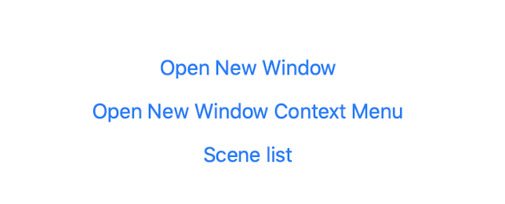

#  CatalystSampler

This repository is sample code list for macOS Catalyst.

## Environment

- macOS Catalyst or over
- Xcode 11 or over

## Sample codes

- Menu
  - MenuBarProvider  
  
- Context Menu
    - ContextMenuView(SwiftUI)
      
    - ContextMenuViewController(UIKit)
      
    - ContextTableView
      
    - ContextCollectionView
      
- Window Scene Control
    - SceneControlView
      
    - SceneListView
- Toolbar
    - ToolbarDelegate
      
- Touch Bar
    - TouchBarView
      
